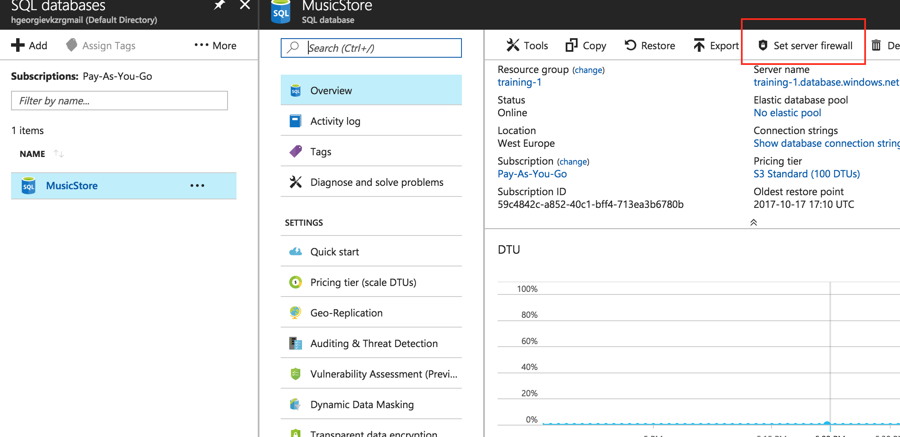

# DevOps Challenge \#2 #

In this challenge, you will move the ASP.NET application to a Docker container. 
After you have created and tested the image locally, you will set up an Azure Container Registry and use the build pipeline
to build and publish the image to this registry.
Finally you will publish the container to an already created Azure Container Service cluster using the Kubernetes user interface.

When you succesfully completed the challenge, your webapplication is running in a Docker container on a cluster.

## Content ##
* [Achievements](#achievements)
* [Bonus Goals](#bonus-goals)
* [Pre-requisites](#pre-requisites)
* [Getting started](#getting-started)
* [Resources](#resources)

## Achievements ##
|#| Achievement   |
|---|---------------|
|1| Configure a build agent |
|2| Create a Dockerfile and build a local Docker image with the webapplication installed |
|3| Set up an Azure Container Registry |
|4| Create a build definition for your containerized application |
|5| Set up a release pipeline that consumes the container from your Azure Container Registry |

## Bonus Goals ##
|#| Bonus Goal   |
|---|---------------|
|1| Containerize SQL server and connect it to the webapplication container (with docker compose) |
|2| Incorporate unit tests |
|3| Clean-up environment after release |
|4| Make sure pipeline can deploy if the previous release failed |
|5| Setup continuous deployments ||
|6| Setup and Use Kubernetes on Azure Container Sevrice to run your container and let your Azure WebApp website use this. |

## Pre-requisites ##
*   Pipeline per team
*   Visual Studio 2017 Enterprise (with the Coded UI test component)
*   Docker for Windows [installed](https://download.docker.com/win/stable/InstallDocker.msi) 
*   Azure Subscription
*   Team Project for venue with git repo per challenge team; VSTS account per participant
*   Participants need administrator role on the Default Agent Pool (to be able to install a local build agent)
*   Participants need administrator rights to add new service end-points in VSTS 
*   Azure Database for ASP.NET Music Store (created in Challenge 1)
*   Docker Integration VSTS extension from the Azure Marketplace
*   Base Docker image downloaded (already pulled for you)

## Getting started ##
* [Verify the Docker installation and explore the application](https://docs.docker.com/docker-for-windows/#check-versions-of-docker-engine-compose-and-machine)
* Clone the started code from [https://github.com/GlobalDevOpsBootcamp/challenge1](https://github.com/GlobalDevOpsBootcamp/challenge1) to your VSTS project as described in challenge1
* Download code for Challenge 2 - [provisioning-docker folder](./provisioning-docker) and nested files.


## Achievement \#1 - Create a Dockerfile and build a local Docker image with the webapplication installed ##
### What do we need to rollout an ASP.NET website to a windows docker container? ###

To run an ASP.NET 4.X website you need the following things:

*   The Operating system with IIS installed
*   ASP.NET 4.X installed
*   Webdeploy installed

### Building the container with IIS, ASP.NET and Webdeploy ###
* Validate that the docker image microsoft/aspnet (this image contains OS with IIS and ASP.NET) is on your local machine by using the command   ```docker images```
you should see in the list microsoft/aspnet.
If it is not there you can get it by using the command ```docker pull micrsoft/aspnet```
* Get the file named [Dockerfile](./provisioning-docker/Dockerfile) (without extension)

### Create publishing profile for web application ###
* In Visual Studio right click the MvcMusicStore project
* Select Publish
* Select Create new profile
* Select IIS, FTP, etc. --> OK
* Select `Web Deploy Package` as Publish method
* Package location: `C:\temp-docker\MvcMusicStore.zip`
* Sitename: `Default Web Site`
* Save the profile
* Select CustomProfile and click Publish

### Create image and run locally ###
* Copy `dockerfile` to c:\temp-docker from the MvcMusic store repo folder: provisioning-docker
* Copy `fixAcls.ps1` to c:\temp-docker from the MvcMusic store repo folder: provisioning-docker
* Copy `WebDeploy_2_10_amd64_en-US.msi` to c:\temp-docker from the MvcMusic store repo folder: provisioning-docker
* Open PowerShell command prompt and execute:

```
    docker build . -t mycontainerizedwebsite
    docker run -p 80:80 -d --name mvcmusicstore mycontainerizedwebsite
    docker inspect --format '{{.NetworkSettings.Networks.nat.IPAddress}}' mvcmusicstore

```

* Use the returned IP address to navigate to the website in your browser : `http://[IP_Adress]` or `http://[IP_Adress]/MvcMusicStore_deploy`

* In order to connect to the remote database locally, you can add your IP Address to the permitted addresses of your database firewall (You can obtain it from the application error once you open the docker image).



* To stop the container
```
    docker stop mvcmusicstore
    docker rm mvcmusicstore
```

## Achievement \#2 - Set up an Azure Container Registry ##
* Navigate to the Azure Portal of your Azure Subscription
* Navigate to the Container Registries service
* Click on Add to add a Azure Container Registry
* Enter a name for the registry in the following format:  centro<TEAMNAME>
* Use the same resource group  
* Click on Create

* Copy the login server name from the overview page of your Container Registry (eg. centro<TEAMNAME>.azurecr.io) for later use.

* Navigate to the access keys of your Container Registry and `enable` Admin user
* Copy the `username` and `password2`


## Achievement \#3 - Create a build definition for your containerized application ##
* Navigate to your VSTS environment and select Builds
* Duplicate the Build Definition from Challenge 1 (from the Build list, click on '...' and then choose "Clone")

### Change task: Build solution **\*.sln (to publish a WebDeploy package on build)
* Click on the Build solution **\*.sln task
* Change the build to 
```
 /p:DeployOnBuild=true;PublishProfile=CustomProfile 
 /p:WebPublishMethod=Package /p:PackageAsSingleFile=true 
 /p:SkipInvalidConfigurations=true /p:PackageLocation="$(build.stagingDirectory)/provisioning-docker"
 ```

### Add task: copy docker assets to staging directory
* Add a Copy Files task below the Index Sources & Publish Symbols task
* Change source folder to ```provisioning-docker```
* Change contents to ```**```
* Change target folder to ```$(build.stagingDirectory)/provisioning-docker```

### Create ImageName variable
* Navigate to the "Variables" tab
* Add a new variabele with the name ```ImageName```
* Set the value to ```centro<TEAMNAME>.azurecr.io/mvcmusicstore:$(Build.BuildId)``` (for example ```hilversumteam0001.azurecr.io/mvc-music-store:$(Build.BuildId)```)


### Create ContainerName variable
* Navigate to the "Variables" tab
* Add a new variabele with the name ```ContainerName```
* Set the value to ```mvcmusicstore```

### Add task: Build an image
* Add a Docker task (the one with the whale icon)
* Choose `Azure Container Registry` under container registry type and choose a subscription
* Choose `centro<TEAMNAME>` for the Azure Container registry
* Change action to ```Build an image```
* Change Docker File to ```$(build.stagingDirectory)/provisioning-docker/Dockerfile```
* Change Build Context to ```$(build.stagingDirectory)/provisioning-docker```
* Change Image Name to ```$(ImageName)```
* Check the Include Latest Tag checkbox

### Add task: Push an image ###
* Add another Docker task (the one with the whale icon again)
* Choose `Azure Container Registry` under container registry type and choose a subscription
* Choose `centro<TEAMNAME>` for the Azure Container registry
* Select the created Registry end-point as Docker Registry Connection in the dropdown
* Change action to ```Push an image```
* Change Image Name to ```$(ImageName)```
* Check the Include Latest Tag checkbox

### Add task: Publish artifact: MvcMusicStore
*Even though we are publishing a docker image to our Azure container registry, we also need to publish an artifact to VSTS so that he release definition can be linked to this artifact. This is required to access information about this build during the release*
* Add a Publish Artifact task
* Change Path to Publish to: ```$(build.stagingDirectory)```
* Change Artifact name to: ```MvcMusicStore```
* Change Artifact publish location to: ```Visual Studio Team Services/TFS```

## Achievement \#4 - Set up a release pipeline that consumes the container from your Azure Container Registry
* Navigate to your VSTS environment and select "Builds"
* Create a new Release Дefinition
* Use the previously created build definition as Sources
* Rename your environment (for example to Test)


### Add task: Run an image
* Add a Docker task (the one with the whale icon)
* Change Docker Registry Connection to you previous registry (`centro<TEAMNAME>`)
* Change action to ```Run an image```
* Change Image Name to ```$(ImageName)```
* Change Container Name to ```$(ContainerName)```
* Change Ports to ```80:80```

### Add task: Manual Intervention
* Add a Server phase in your Release definition
* Add a Manual Intervention task
* Change instructions to:
```
Logon to the agent
docker inspect --format '{{ .NetworkSettings.Networks.nat.IPAddress }}' mvcmusicstore

Use the returned IP address to navigate to the website in your browser
```

###  Add another Agent phase
### Add task: Run a Docker command (stop container)
 In the second agent phase:
* Add a Docker task (the one with the whale icon)
* Change the name of the task to: ```Run a Docker command (stop container)```
* Change action to ```Run a Docker command```
* Change command to ```stop $(ContainerName)```

### Add task: Run a Docker command (remove container)
 In the second agent phase:
* Change the name of the task to: ```Run a Docker command (stop container)```
* Add a Docker task (the one with the whale icon)
* Change action to ```Run a Docker command```
* Change command to ```rm $(ContainerName)```

### Run both Agent phases on the default queue
* Select each Agent phase (```Run on agent```)
* Change Deployment queue to ```Default```
* Under Additional options check ```Skip artifacts download```
*We don't actually need the artifacts, but we do need the information that is provided by linking the artifacts to the release*

## Bonus Goal \#5 - Deploy the application to Kubernetes ##
Setup and Use Kubernetes to run your container and let your Azure WebApp website use this.


